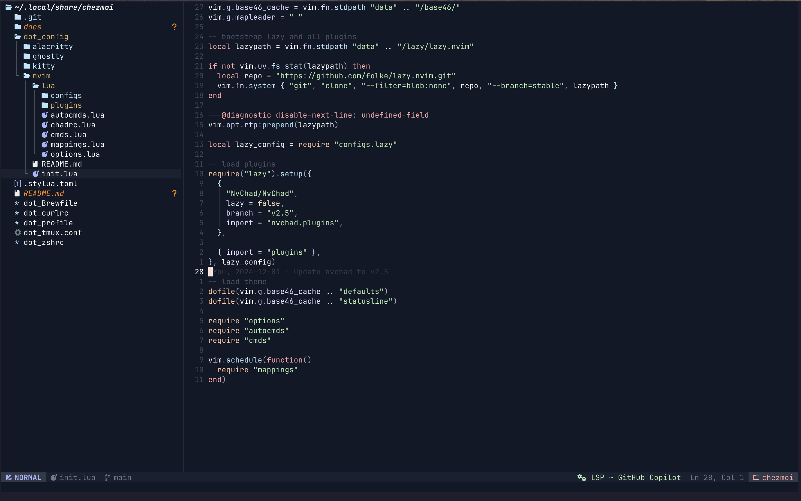
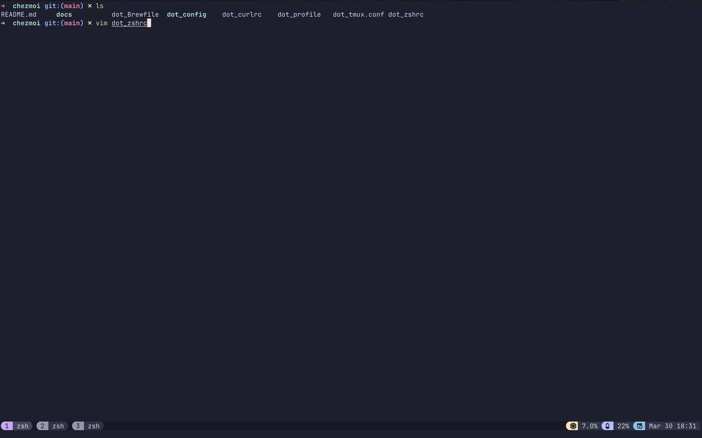

# dotfiles

These are my personal dotfiles for macOS, managed by [chezmoi](https://www.chezmoi.io/). Linux support is not guaranteed as I have not tested it, most likely some changes are required.

## Tools

- [`homebrew`](https://github.com/Homebrew/brew) - Cross-platform package manager.
- [`neovim`](https://neovim.io/) - Vim-fork focused on extensibility and usability.
- [`ghostty`](https://github.com/ghostty-org/ghostty) - Terminal emulator. This is what I am currently using.
- [`tmux`](https://github.com/tmux/tmux) - Terminal multiplexer.
- [`oh-my-zsh`](https://github.com/ohmyzsh/ohmyzsh/) - Framework for managing zsh configuration.

## Screenshots

    

    

